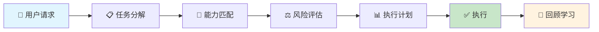
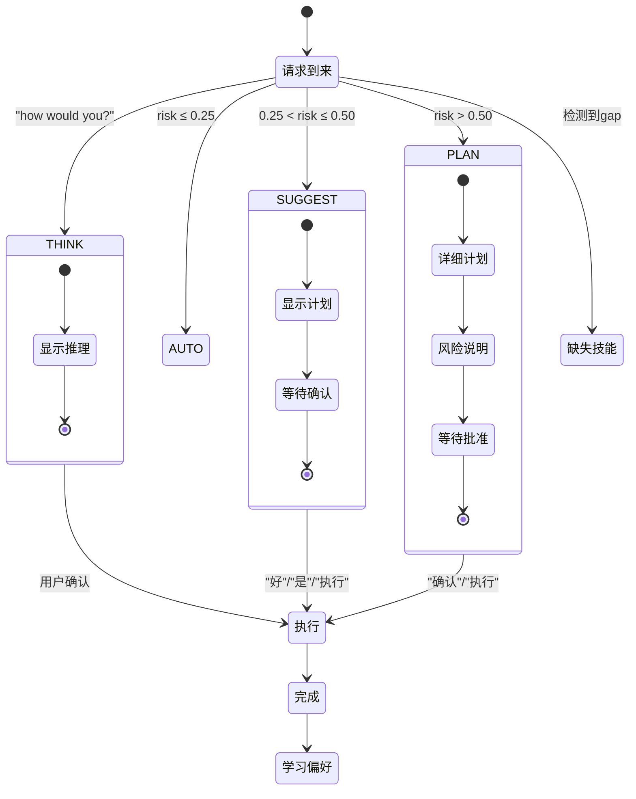

# Skill Orchestrator

<p align="center">
  
  
  
</p>

> **A production-grade meta-skill for Claude Code — the intelligent router between you and all other skills.**

当你想完成一个复杂任务时（比如"分析销售数据并生成PPT"），Skill Orchestrator 会自动帮你：
1. 理解你的意图
2. 选择最合适的技能
3. 规划执行步骤
4. 评估风险和成本
5. 执行并跟踪进度

---

## 工作原理



### 详细流程

```
┌─────────────────────────────────────────────────────────────────────┐
│                        SKILL ORCHESTRATOR 完整流程                      │
└─────────────────────────────────────────────────────────────────────┘

Step 1: 任务分解 (Task Decomposition)
━━━━━━━━━━━━━━━━━━━━━━━━━━━━━━━━━━
  输入: "分析季度销售数据并生成PPT汇报"

  分解结果:
  ┌─────────────────────────────────────────────┐
  │ Goal:    分析季度销售数据并生成PPT汇报           │
  │ Inputs:  sales_q4.csv                      │
  │ Outputs: 季度汇报.pptx                      │
  │ Capabilities: [spreadsheet, pptx]           │
  └─────────────────────────────────────────────┘

Step 2: 能力匹配 (Capability Matching)
━━━━━━━━━━━━━━━━━━━━━━━━━━━━━━━━━━━
  置信度评分 (5因子模型):

  ┌─────────────────────────────────────────────┐
  │ spreadsheet: 0.90                          │
  │   ├─ keywordScore:    0.95                 │
  │   ├─ semanticScore:   0.88                 │
  │   ├─ historicalScore: 0.85                │
  │   ├─ coverageScore:  0.90                 │
  │   └─ recencyBoost:    0.80                 │
  │                                              │
  │ pptx: 0.85                                 │
  │   ├─ keywordScore:    0.90                 │
  │   ├─ semanticScore:   0.85                 │
  │   ├─ historicalScore: 0.82                 │
  │   ├─ coverageScore:   0.88                 │
  │   └─ recencyBoost:    0.75                 │
  └─────────────────────────────────────────────┘

Step 3: 风险评估 (Risk Assessment)
━━━━━━━━━━━━━━━━━━━━━━━━━━━━━━━━━━━
  风险维度评分:

  ┌─────────────────────────────────────────────┐
  │ Risk Score = 0.38 (MEDIUM)                │
  │                                              │
  │ ├─ risk_level:    0.50 (MEDIUM) × 0.30    │
  │ ├─ reversibility:  0.50 (SEMI)   × 0.20    │
  │ ├─ cross_system:   0.30 (LOW)    × 0.20    │
  │ ├─ skill_count:    0.20 (2skills)× 0.15    │
  │ └─ user_expertise: 0.50 (MEDIUM) × 0.15    │
  └─────────────────────────────────────────────┘

  → 执行模式: SUGGEST (等待确认)

Step 4: 执行计划 (Execution Plan)
━━━━━━━━━━━━━━━━━━━━━━━━━━━━━━━━━━

  ┌─────────────────────────────────────────────┐
  │ 依赖关系图 (Dependency Graph):                │
  │                                              │
  │   ┌─────────┐      ┌─────────┐              │
  │   │ Step 1  │ ───► │ Step 2  │              │
  │   │xlsx:分析│ data │pptx:生成│              │
  │   └─────────┘      └─────────┘              │
  │      数据流         依赖                     │
  │                                              │
  │ 并行组: [Step 1] → [Step 2]                │
  └─────────────────────────────────────────────┘

Step 5: 执行与跟踪 (Execution & Progress)
━━━━━━━━━━━━━━━━━━━━━━━━━━━━━━━━━━━━━━━━━━

  [████████████████████░░░░░░░░] 80%
  Step 1: spreadsheet ✅
  Step 2: pptx 🔄 进行中...
```

---

## 核心特性

### 1. 智能任务分解

```
用户输入 → Goal + Inputs + Outputs + Capabilities

"帮我分析这个CSV然后做个PPT"
    ↓
┌────────────────────────────────────┐
│ Goal:     分析CSV并生成PPT           │
│ Inputs:   data.csv                 │
│ Outputs:  演示文稿.pptx             │
│ Capabilities: [spreadsheet, pptx]   │
└────────────────────────────────────┘
```

### 2. 多因子置信度匹配

```
Confidence = keywordScore × 0.25
           + semanticScore × 0.25
           + historicalSuccess × 0.25
           + coverageScore × 0.15
           + recencyBoost × 0.10
```

| 因子 | 权重 | 说明 |
|-----|-----|-----|
| keywordScore | 25% | 关键词匹配度 |
| semanticScore | 25% | 语义相似度 |
| historicalSuccess | 25% | 历史成功率 |
| coverageScore | 15% | 能力覆盖度 |
| recencyBoost | 10% | 最近使用加成 |

### 3. 多维度风险评估

```
Risk Score = risk_level × 0.30
           + reversibility × 0.20
           + cross_system × 0.20
           + skill_count × 0.15
           + user_expertise × 0.15
```

| 风险等级 | 分数 | 示例操作 |
|---------|------|---------|
| LOW | 0.2 | 读取文件、API查询 |
| MEDIUM | 0.5 | 创建文件、API写入 |
| HIGH | 0.75 | 文件删除、配置修改 |
| CRITICAL | 1.0 | rm -rf、生产库写入 |

### 4. 执行模式自动切换



### 5. 技能冲突解决

当多个技能都可以完成任务时，使用 5 维度评分：

```
Score = Precision × 0.30 + Coverage × 0.25 + Performance × 0.20
      + UserPreference × 0.15 + Recency × 0.10
```

| 分差 | 解决方案 |
|-----|---------|
| ≥ 0.30 | **AUTO** - 自动选择，告知用户 |
| 0.15-0.30 | **HYBRID** - 推荐，询问确认 |
| < 0.15 | **MANUAL** - 列出选项让用户选 |

### 6. 依赖图与并行执行

使用 Kahn 算法进行拓扑排序，确定最优执行顺序：

```
原始任务: "分析CSV → 生成图表 → 制作PPT"

依赖分析:
┌─────────────────────────────────────────┐
│  Step 1: spreadsheet.analyze (无依赖)      │
│  Step 2: canvas-design.create_chart (无依赖)│
│  Step 3: pptx.generate (依赖 Step 1, 2)   │
└─────────────────────────────────────────┘

拓扑排序结果 (可并行部分并行):
┌─────────────────────────────────────────┐
│ 并行组 1: [Step 1, Step 2]              │
│ 并行组 2: [Step 3] (等待组1完成)          │
└─────────────────────────────────────────┘

执行顺序:
  ① Step 1 ─┬─► Step 3
  ② Step 2 ─┘
```

---

## 快速开始

### 安装

```bash
# 方式1: 克隆到 Claude skills 目录
git clone https://github.com/sl820/skill-orchestrator.git
mv skill-orchestrator ~/.claude/skills/skill-orchestrator

# 方式2: 作为独立工具使用
pip install skill-orchestrator
```

### 使用示例

#### 示例 1: 数据分析流程

```python
from orchestrator import invoke

# 输入请求
result = invoke("分析销售数据并生成图表")

print(f"技能数: {len(result['skills'])}")
print(f"执行计划: {result['plan']['steps']}")
```

**输出:**
```
━━━━━━━━━━━━━━━━━━━━━━━━━━━━━━━━━━━━━━━━━━━━━━━
📋 执行计划 - 分析销售数据并生成图表
━━━━━━━━━━━━━━━━━━━━━━━━━━━━━━━━━━━━━━━━━━━━━━━

🎯 任务分解:
   目标: 分析销售数据并生成图表
   输入: sales.csv
   输出: 图表.png

🔗 匹配技能:
   ✅ spreadsheet (置信度: 90%)
   ✅ canvas-design (置信度: 85%)

⚖️ 风险评估:
   分数: 0.35 (MEDIUM)
   可逆性: SEMI_REVERSIBLE

📊 执行计划:
   步骤 1: spreadsheet → 分析CSV
   步骤 2: canvas-design → 生成图表

💰 预估成本:
   Token: ~2,500
   时间: ~15秒

━━━━━━━━━━━━━━━━━━━━━━━━━━━━━━━━━━━━━━━━━━━━━━━
确认执行? (好/是/执行)
━━━━━━━━━━━━━━━━━━━━━━━━━━━━━━━━━━━━━━━━━━━━━━━
```

#### 示例 2: 复杂多步骤任务

```python
result = invoke("从网页抓取数据，分析后生成PPT报告")
```

**执行流程:**
```
┌──────────────────────────────────────────────────────────┐
│                    任务: 网页→分析→PPT                      │
├──────────────────────────────────────────────────────────┤
│                                                          │
│  Step 1: web-access                                     │
│    └─ 抓取目标URL数据                                     │
│                    │                                      │
│                    ▼ data                                 │
│  Step 2: spreadsheet ──────┐                           │
│    └─ 数据分析处理           │ union                      │
│                    │         │                           │
│                    ▼         ▼                           │
│  Step 3: pptx ◄────┴────────┘                           │
│    └─ 生成汇报PPT                                        │
│                                                          │
│  ⏱️ 预计时间: 45秒                                        │
│  💰 预计Token: 8,500                                     │
└──────────────────────────────────────────────────────────┘
```

---

## 架构设计

```
skill-orchestrator/
│
├── 📁 orchestrator/              # 核心引擎
│   ├── __init__.py              # 入口点 (invoke, main)
│   ├── models.py                # 数据模型
│   ├── decomposition.py         # 任务分解引擎
│   ├── mapping.py              # 能力→技能映射
│   ├── scoring.py              # 置信度评分
│   ├── conflict.py             # 冲突解决
│   ├── risk.py                 # 风险评估
│   ├── dependency_graph.py     # Kahn拓扑排序
│   ├── executor.py              # 执行引擎
│   ├── retry.py                # 重试策略
│   ├── failure.py              # 失败处理
│   ├── control_flow.py         # IF/RETRY控制流
│   ├── progress.py             # 进度跟踪
│   ├── cost.py                 # 成本估算
│   ├── versioning.py           # 版本追踪
│   ├── preferences.py         # 偏好学习
│   ├── integration.py          # 主协调器
│   └── post_execution.py       # 执行回顾
│
├── 📁 scripts/
│   └── scan_skills.py          # 技能扫描工具
│
└── 📁 evals/
    └── evals.json              # 评估数据
```

---

## 能力映射表

| 你的需求 | 匹配技能 | 置信度 | 备选技能 |
|---------|---------|--------|---------|
| 分析CSV/Excel数据 | `xlsx` | 90% | `canvas-design` |
| 创建PPT演示文稿 | `pptx` | 88% | `canvas-design` |
| 读写PDF文件 | `pdf` | 92% | `docx` |
| 创建Word文档 | `docx` | 85% | `doc-coauthoring` |
| 抓取网页内容 | `web-access` | 87% | - |
| 测试网页应用 | `webapp-testing` | 84% | `web-access` |
| 创建React组件 | `web-artifacts-builder` | 89% | `frontend-design` |
| 创建设计图 | `canvas-design` | 86% | `pptx` |
| 生成算法艺术 | `algorithmic-art` | 86% | `canvas-design` |
| 创建内部通讯 | `internal-comms` | 88% | `docx` |
| 构建MCP服务 | `mcp-builder` | 90% | - |
| 创建测试GIF | `slack-gif-creator` | 85% | `algorithmic-art` |
| ... | ... | ... | ... |

---

## API 参考

### `invoke(request: str) -> dict`

自动执行入口函数，处理完整流程。

```python
result = invoke("分析CSV并生成图表")

# 返回结构
{
    "skills": [...],           # 已安装技能列表
    "mcp_servers": [...],     # MCP服务器
    "plan": {
        "task_goal": "...",
        "mode": "SUGGEST",
        "risk_level": "MEDIUM",
        "risk_score": 0.35,
        "steps": [...],
        "gaps": [],
        "parallel_groups": [...],
        "estimated_cost": {...}
    },
    "error": None              # 错误信息
}
```

### `create_orchestrator() -> SkillOrchestrator`

创建手动控制的协调器实例。

```python
from orchestrator import create_orchestrator

orchestrator = create_orchestrator()
plan = orchestrator.plan("你的请求")
result = await orchestrator.execute(plan)
```

---

## 配置选项

```python
# 置信度权重
CONFIDENCE_WEIGHTS = {
    "keyword": 0.25,
    "semantic": 0.25,
    "historical": 0.25,
    "coverage": 0.15,
    "recency": 0.10,
}

# 风险权重
RISK_WEIGHTS = {
    "risk_level": 0.30,
    "reversibility": 0.20,
    "cross_system": 0.20,
    "skill_count": 0.15,
    "user_expertise": 0.15,
}

# 执行模式阈值
EXECUTION_MODE_THRESHOLDS = {
    "AUTO": 0.25,
    "SUGGEST": 0.50,
    "PLAN": 0.75,
}
```

---

## Contributing

贡献代码、报告问题或提出功能建议！

1. Fork 本仓库
2. 创建特性分支 (`git checkout -b feature/amazing`)
3. 提交更改 (`git commit -m 'Add amazing feature'`)
4. 推送到分支 (`git push origin feature/amazing`)
5. 创建 Pull Request

---

## License

MIT License - 详见 [LICENSE](LICENSE) 文件
